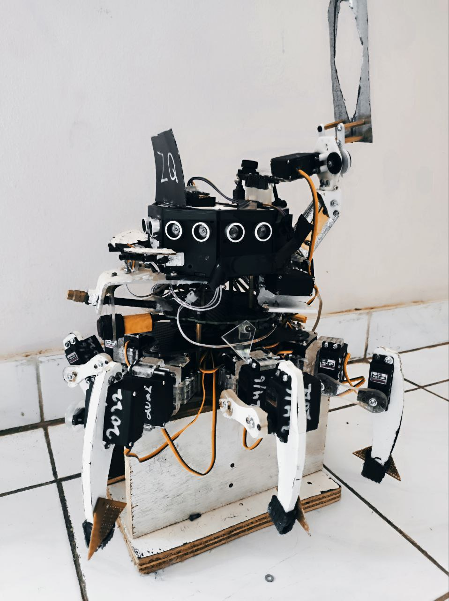
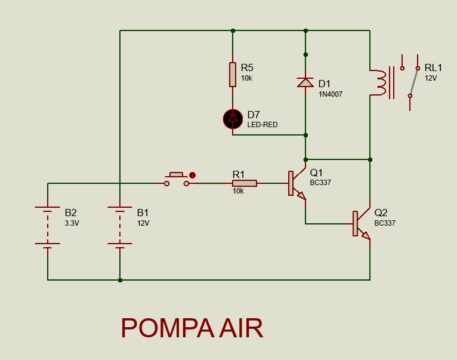
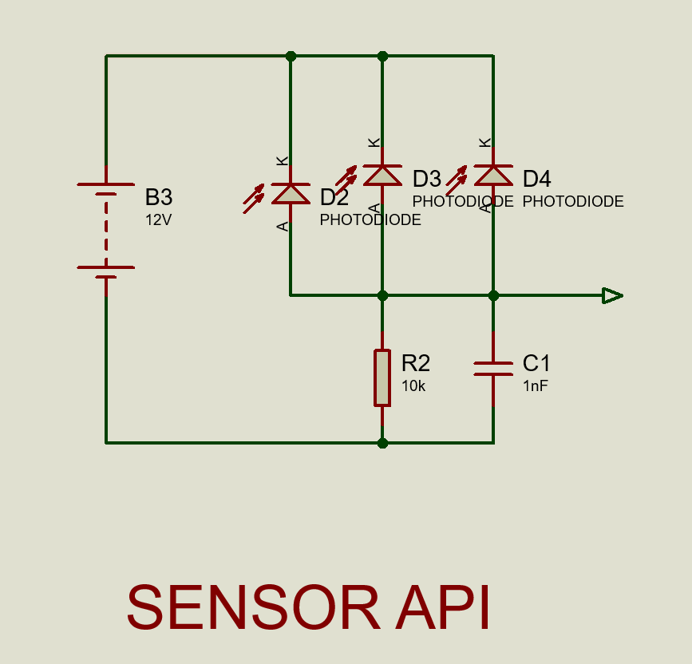
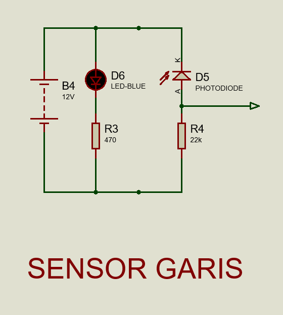

# HEXAPOD Robot - KRSRI

## Description
This Hexapod robot using Arduino Mega 2560 as uC to controll all input devices and output devices. As the name, this robot has 6 legs with 3 joints on each leg  which are controlled by a servo motor. This hexapod robot can also walk autonomously to find travel routes and pass through existing obstacles to save victims and extinguish fires. Obstacles that this robot can overcome include uneven roads, potholes, uphill roads, stairs, mazes, extinguishing fires, and this robot has a camera that can identify victims for rescue.

## Block Diagram

## Wiring Diagram

****************************************************
Created 2022 By Team URC
